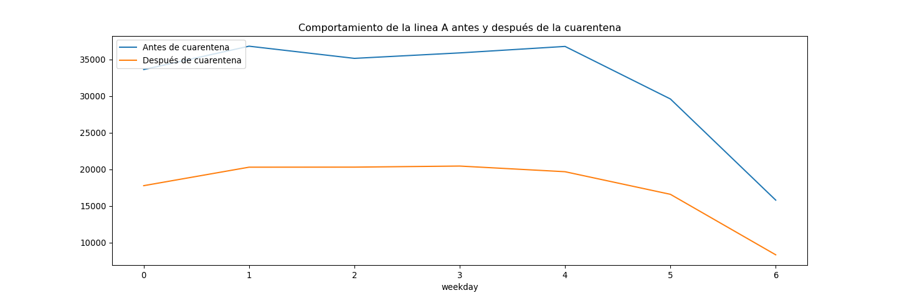
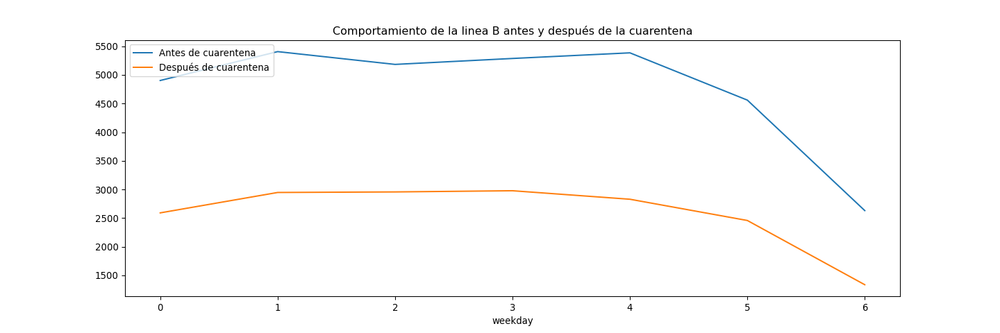
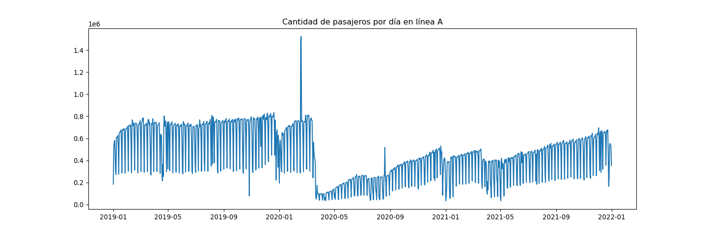
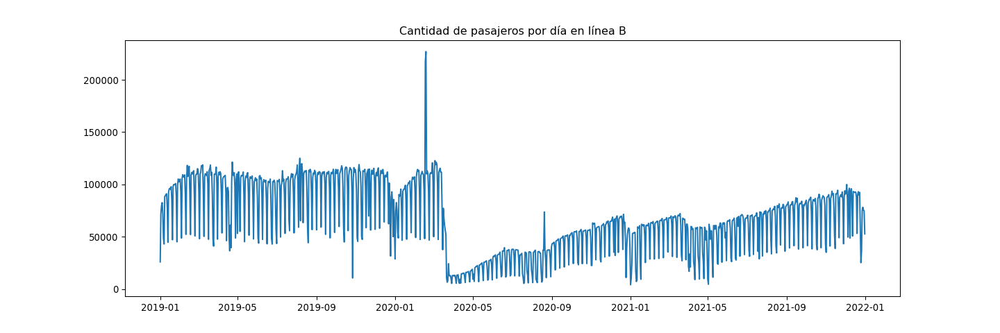
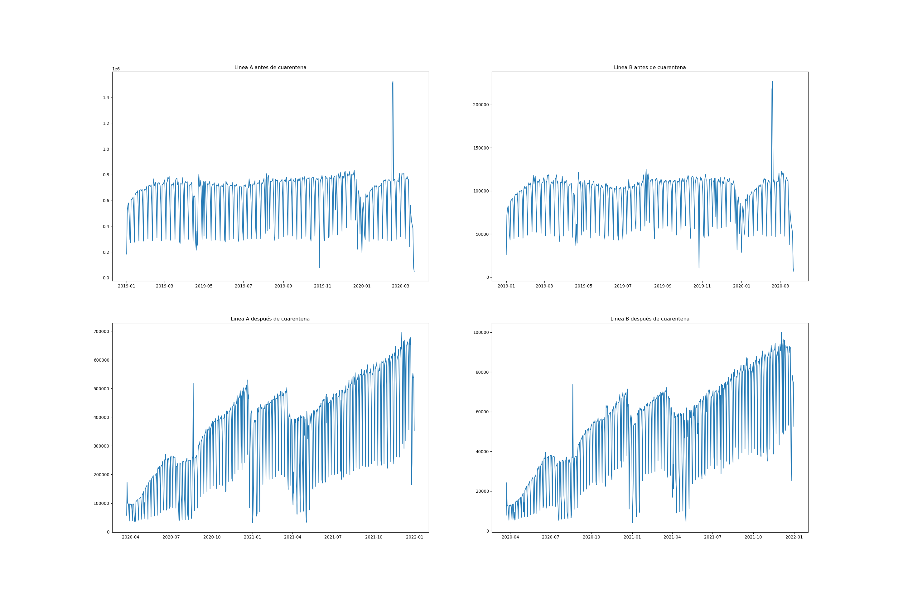

Análisis de series de tiempo línea A y B del metro
================
Santiago Franco Valencia
14/9/2022

## A

Se realiza el preprocesamiento de los datos utilizando pandas:

``` python
#Lectura de datos
datos_2019 = pd.read_excel("Afluencia_Metro_2019.xlsx", skiprows=2)
datos_2020 = pd.read_excel("Afluencia_Metro.xlsx", skiprows=2)
datos_2021 = pd.read_excel("Afluencia_2021.xlsx", skiprows=2)

print(f'La base de datos del 2019 tiene dimensiones: {datos_2019.shape}')
```

    La base de datos del 2019 tiene dimensiones: (3563, 23)

``` python
print(f'La base de datos del 2020 tiene dimensiones: {datos_2020.shape}')
```

    La base de datos del 2020 tiene dimensiones: (3764, 23)

``` python
print(f'La base de datos del 2021 tiene dimensiones: {datos_2021.shape}')
```

    La base de datos del 2021 tiene dimensiones: (4122, 23)

``` python
# Arreglo nombres
nombres = list(datos_2019.columns)
nombres[0] = "fecha"
nombres[1] = "linea"
nombres[len(nombres)-1] = "total_dia"
```

## B

Se concantenan los datos mediante el metodo concat de pandas:

``` python
# Union de datos
datos_juntos = pd.concat([datos_2019, datos_2020, datos_2021])
# Arreglo nombres
datos_juntos.columns=nombres
print(f'Se tiene que los tres conjuntos de datos unidos tienen dimensiones: f{datos_juntos.shape}')
```

    Se tiene que los tres conjuntos de datos unidos tienen dimensiones: f(11449, 23)

## C

Se realiza un cambio de datos anchos a largos a través del método melt
del paquete pandas:

``` python
datos = pd.melt(datos_juntos, id_vars=['fecha', 'linea', 'total_dia'],
                var_name=['hora'], value_name="total_hora")
```

Posteriormente se añaden las variables de día, día de la semana, semana,
mes y año, adicionalmente se ordenan los datos respecto a la fecha y la
hora:

``` python
# Dia
datos['day'] = datos.fecha.dt.day
# Dia de la semana
datos['weekday'] = datos.fecha.dt.weekday
# Semana
datos['week'] = datos.fecha.dt.isocalendar().week
# Mes
datos['month'] = datos.fecha.dt.month
# Anio
datos['year'] = datos.fecha.dt.year

# Arreglo registros en mayúscula
datos['linea'] = datos['linea'].str.upper()

# Arreglo final
datos = datos[['fecha', 'hora', 'day', 'weekday', 'week', 'month',
                'year', 'total_hora', 'total_dia', 'linea']]
datos.sort_values(by =['fecha', 'hora'], inplace=True)

print(f'Se tiene que luego de haber pasado los datos de anchos a largos se obtiene \nun conjunto de datos de medidas: {datos.shape}')
```

    Se tiene que luego de haber pasado los datos de anchos a largos se obtiene 
    un conjunto de datos de medidas: (228980, 10)

## D

Se realiza la división de las dos bases de datos, en este caso NO se
ordenan ya que en un paso previo fueron ordenados y al dividirse los
datos se respeta el orden.

``` python
# Datos linea A
dat_lin_A = datos[datos['linea'] == 'LÍNEA A']
# Datos linea B
dat_lin_B = datos[datos['linea'] == 'LÍNEA B']

print(f'Se tiene que las dimensiones de los datos de la linea A son: {dat_lin_A.shape}\n',
f'Se tiene que las dimensiones de los datos de la linea B son: {dat_lin_B.shape}')
```

    Se tiene que las dimensiones de los datos de la linea A son: (21860, 10)
     Se tiene que las dimensiones de los datos de la linea B son: (21860, 10)

## E

El día 23 de marzo de 2020 fue el inicio de la cuarentena en Colombia,
en términos de series de tiempo esto puede producir un fenómeno llamado
‘inestabilidad estructural’ el cuál representa un cambio abrupto en el
comportamiento de una serie de tiempo, se calculan los promedios de
pasajeros por hora según el día de la semana antes y después de la
cuarentena y se grafican en un gráfico de lineas:

``` python
# Registros antes del 23 de marzo de 2020
lin_A_before = dat_lin_A[dat_lin_A['fecha'] < '2020-03-23']
lin_B_before = dat_lin_B[dat_lin_B['fecha'] < '2020-03-23']
# Registros despues del 23 de marzo de 2020
lin_A_after = dat_lin_A[dat_lin_A['fecha'] >= '2020-03-23']
lin_B_after = dat_lin_B[dat_lin_B['fecha'] >= '2020-03-23']
```

Se grafica el comportamiento de la linea A antes y después de la
cuarentena:



Se grafica el comportamiento de la linea B antes y después de la
cuarentena:



En ambas gráficas de líneas se observa cómo claramente se tiene una
cantidad promedio constante de pasajeros por hora en los días de la
semana, además que se observa que disminuye el número de pasajeros por
hora en los días sábados y domingos.

Una primer hipótesis para este comportamiento es suponer que en los
fines de semana al haber menos personas trabajando se tiene un flujo más
bajo de pasajeros en las líneas A y B del metro.

## F

Se obtienen dos nuevos conjuntos de datos que contienen las variables
fecha, día, día de la semana, semana, mes, año y total de pasajeros por
día seleccionando dichas variables y usando el método drop\_duplicates
de pandas:

``` python
# Datos por dia
dat_lin_A_day = dat_lin_A[['fecha', 'day', 'weekday', 'week', 'month', 'year', 'total_dia']].\
drop_duplicates()
dat_lin_B_day = dat_lin_B[['fecha', 'day', 'weekday', 'week', 'month', 'year', 'total_dia']].\
drop_duplicates()

print(f'Dimensiones linea A por día: {dat_lin_A_day.shape}\n',
f'Dimensiones linea B por día: {dat_lin_B_day.shape}')
```

    Dimensiones linea A por día: (1093, 7)
     Dimensiones linea B por día: (1093, 7)

## G

Se grafica la serie de tiempo de la línea A:



Se grafica la serie de tiempo de la línea B:



Tanto la serie de la línea A cómo en la serie de la línea B se observan
indicios de ‘inestabilidad estructural’, indicando así que hasta el 23
de marzo de 2020 las series tenían un comportamiento y después del 23 de
marzo de 2020 las series tomaron otro comportamiento, en general se
tiene que, para ambas series:

-   Hasta el 23 de marzo de 2020 se tenía un comportamiento netamente
    estacional, sin ninguna tendencia, en dónde siempre había un
    decaimiento de los pasajeros por día en los días domingos y una
    menor cantidad de pasajeros a finales del 2019 e inicios del 2020.

-   Después del 23 de marzo de 2020 la serie cambia su comportamiento
    teniendo una caída en la cantidad de pasajeros por día y añadiendo
    una componente de tendencia, obteniendo así que la cantidad de
    pasajeros oscila y disminuye en los fines de semana conservando un
    comportamiento al alza a través de las semanas.

## H

Se divide cada conjunto de datos respecto a la fecha en la que inició la
cuarentena en el país:

``` python
# Division de datos segun fecha de pandemia
dat_lin_A_day_before = dat_lin_A_day[dat_lin_A_day['fecha'] < '2020-03-23']
dat_lin_B_day_before = dat_lin_B_day[dat_lin_B_day['fecha'] < '2020-03-23']
dat_lin_A_day_after = dat_lin_A_day[dat_lin_A_day['fecha'] >= '2020-03-23']
dat_lin_B_day_after = dat_lin_B_day[dat_lin_B_day['fecha'] >= '2020-03-23']
```

Se grafican los datos con el fin de realizar así un análisis
descriptivo:



Claramente en las cuatro gráficas se puede observar:

-   Qué en la línea A se tiene un flujo de pasajeros mucho más alto que
    en la línea B tanto cómo antes cómo después del día de la cuarentena
    (23 de marzo de 2020)
-   Qué sí se separan los conjuntos de datos de la línea A y de la línea
    B se obtienen dos series de tiempo diferentes para cada línea en
    dónde antes de la cuarentena se tiene un comportamiento estacionario
    y después de la pandemia se tiene un comportamiento estacionario con
    tendencia.

A partir de las conclusiones anteriores se plantea que algún posible
modelo para cada conjunto de datos sería:

-   Para antes del día de la cuarentena un modelo estacional con
    categóricas asociadas al día de la semana.
-   Para después del día de la cuarentena un modelo estacional con
    tendencia, en donde la estacionalidad se asocie al día de la semana.

## Modelamiento para lineas antes de cuarentena

Se plantean los modelos con todas las variables regresoras con el fin de
obtener una tabla con todos los modelos posibles mediante el paquete
olss, a cada tabla se le añaden los dos modelos que tengan el r-cuadrado
ajustado más alto y el aic más bajo:

### Linea A antes de cuarentena

|   n | predictors                    |      adjr |      aic |
|----:|:------------------------------|----------:|---------:|
|   1 | weekday                       | 0.5820014 | 11739.44 |
|   2 | weekday week                  | 0.6823490 | 11663.66 |
|   3 | weekday month week            | 0.6755495 | 11683.48 |
|   4 | t weekday month week          | 0.6750930 | 11684.93 |
|   5 | t weekday month week day      | 0.6848970 | 11672.05 |
|   6 | t weekday month week year day | 0.6848970 | 11674.05 |

En este caso en base a la tabla se tienen 3 modelos candidatos:

De manera similar a la línea A se tienen 3 modelos candidatos:

-   Un modelo que sólo incluya el día de la semana
-   Un modelo que incluya el día de la semana y la semana
-   Un modelo que incluya el día de la semana, el mes y la semana.

En este caso respetando el principio de parsimonia, la interpretabilidad
del modelo y lo hallado en el análisis descriptivo se plantea un modelo
que sólo utiliza el día de la semana como variable regresora para evitar
así problemas de sobreajuste:

``` r
mod_A_before_final <- lm(total_dia ~ weekday, data = dat_lin_A_day_before_prep)
summary(mod_A_before_final)
```


    Call:
    lm(formula = total_dia ~ weekday, data = dat_lin_A_day_before_prep)

    Residuals:
        Min      1Q  Median      3Q     Max 
    -549288   -9835   17419   48963  833205 

    Coefficients:
                Estimate Std. Error t value Pr(>|t|)    
    (Intercept)   666265      15227  43.754  < 2e-16 ***
    weekday1       66687      21451   3.109 0.002000 ** 
    weekday2       32501      21451   1.515 0.130451    
    weekday3       47902      21451   2.233 0.026042 *  
    weekday4       66070      21451   3.080 0.002199 ** 
    weekday5      -78555      21451  -3.662 0.000281 ***
    weekday6     -363721      21451 -16.956  < 2e-16 ***
    ---
    Signif. codes:  0 '***' 0.001 '**' 0.01 '*' 0.05 '.' 0.1 ' ' 1

    Residual standard error: 120900 on 440 degrees of freedom
    Multiple R-squared:  0.5876,    Adjusted R-squared:  0.582 
    F-statistic: 104.5 on 6 and 440 DF,  p-value: < 2.2e-16

Se obtiene que según la línea del análisis descriptivo previo, todos los
niveles de la variable día de la semana son significativos, confirmando
así que según el planteamiento inicial de un modelo de regresión lineal
múltiple se puede asumir que la serie de la cantidad de pasajeros por
día que utilizaron la línea A antes de cuarentena es una serie que tiene
parte estacionaria y que no tiene tendencia. En términos comunes se
podría decir que hasta el 23 de marzo de 2020 el metro pudo haber
previsto el flujo de pasajeros por día en la línea A asumiendo que cada
día se tiene un comportamiento constante asociado a los valores
predichos en el análisis de regresión.

### Linea B antes de cuarentena

|   n | predictors                    |      adjr |       aic |
|----:|:------------------------------|----------:|----------:|
|   1 | weekday                       | 0.5303363 | 10025.104 |
|   2 | weekday week                  | 0.6526786 |  9937.146 |
|   3 | weekday month week            | 0.6456339 |  9956.481 |
|   4 | weekday month week day        | 0.6474282 |  9955.030 |
|   5 | t weekday month week day      | 0.6583932 |  9941.724 |
|   6 | t weekday month week year day | 0.6583932 |  9943.724 |

De manera similar a la línea A se tienen 3 modelos candidatos:

-   Un modelo que sólo incluya el día de la semana
-   Un modelo que incluya el día de la semana y la semana
-   Un modelo que incluya el día de la semana, el mes y la semana.

En este caso respetando el principio de parsimonia, la interpretabilidad
del modelo y lo hallado en el análisis descriptivo se plantea un modelo
que sólo utiliza el día de la semana como variable regresora para evitar
así problemas de sobreajuste:

``` r
mod_B_before_final <- lm(total_dia ~ weekday, data = dat_lin_B_day_before_prep)
summary(mod_B_before_final)
```


    Call:
    lm(formula = total_dia ~ weekday, data = dat_lin_B_day_before_prep)

    Residuals:
       Min     1Q Median     3Q    Max 
    -81698  -2069   3595   7378 120685 

    Coefficients:
                Estimate Std. Error t value Pr(>|t|)    
    (Intercept)    96809       2238  43.260  < 2e-16 ***
    weekday1       10742       3152   3.408 0.000716 ***
    weekday2        6217       3152   1.972 0.049220 *  
    weekday3        8362       3152   2.653 0.008277 ** 
    weekday4       10399       3152   3.299 0.001050 ** 
    weekday5       -6396       3152  -2.029 0.043081 *  
    weekday6      -46717       3152 -14.820  < 2e-16 ***
    ---
    Signif. codes:  0 '***' 0.001 '**' 0.01 '*' 0.05 '.' 0.1 ' ' 1

    Residual standard error: 17760 on 440 degrees of freedom
    Multiple R-squared:  0.5367,    Adjusted R-squared:  0.5303 
    F-statistic: 84.94 on 6 and 440 DF,  p-value: < 2.2e-16

Se obtiene que según la línea del análisis descriptivo previo, todos los
niveles de la variable día de la semana son significativos, confirmando
así que según el planteamiento inicial de un modelo de regresión lineal
múltiple se puede asumir que la serie de la cantidad de pasajeros por
día que utilizaron la línea B antes de cuarentena es una serie que tiene
parte estacionaria y que no tiene tendencia. En términos comunes se
podría decir que hasta el 23 de marzo de 2020 el metro pudo haber
previsto el flujo de pasajeros por día en la línea B asumiendo que cada
día se tiene un comportamiento constante asociado a los valores
predichos en el análisis de regresión.

## Modelamiento para lineas después de cuarentena

### Linea A después de cuarentena

|   n | predictors                    |      adjr |      aic |
|----:|:------------------------------|----------:|---------:|
|   1 | t                             | 0.4913717 | 16939.87 |
|   2 | t weekday                     | 0.7255090 | 16547.37 |
|   3 | t weekday week                | 0.8160514 | 16337.88 |
|   4 | weekday month week day        | 0.8218047 | 16328.23 |
|   5 | t weekday month week year     | 0.8250305 | 16317.31 |
|   6 | t weekday month week year day | 0.8250305 | 16319.31 |

En la línea A después de cuarentena se tienen los siguientes 2 modelos
candidatos:

-   Un modelo que incluya el tiempo t (la unidad de tiempo utilizada
    para modelar la serie).
-   Un modelo que incluya el tiempo t y el día de la semana.

Utilizando este criterio y siguiendo la línea de los análisis
descriptivos se plantea un modelo en dónde se incluye el tiempo t y el
día de la semana para recoger lo que es tendencia y estacionalidad:

``` r
mod_A_after_final <- lm(total_dia ~ t + weekday, data = dat_lin_A_day_after_prep)
summary(mod_A_after_final)
```


    Call:
    lm(formula = total_dia ~ t + weekday, data = dat_lin_A_day_after_prep)

    Residuals:
        Min      1Q  Median      3Q     Max 
    -358700  -41399   11785   59549  224829 

    Coefficients:
                  Estimate Std. Error t value Pr(>|t|)    
    (Intercept)  147603.31   10850.85  13.603  < 2e-16 ***
    t               629.00      18.49  34.018  < 2e-16 ***
    weekday1      50714.52   12851.24   3.946 8.82e-05 ***
    weekday2      50448.14   12851.28   3.926 9.60e-05 ***
    weekday3      51603.02   12886.31   4.004 6.95e-05 ***
    weekday4      35139.53   12851.43   2.734  0.00643 ** 
    weekday5     -27249.97   12958.38  -2.103  0.03587 *  
    weekday6    -191475.85   12886.18 -14.859  < 2e-16 ***
    ---
    Signif. codes:  0 '***' 0.001 '**' 0.01 '*' 0.05 '.' 0.1 ' ' 1

    Residual standard error: 87630 on 638 degrees of freedom
    Multiple R-squared:  0.7285,    Adjusted R-squared:  0.7255 
    F-statistic: 244.5 on 7 and 638 DF,  p-value: < 2.2e-16

Se obtiene que tanto la componente t asociada a la tendencia como todos
los niveles de la variable día de la semana son significativos,
confirmando así que según el planteamiento inicial de un modelo de
regresión lineal múltiple se puede asumir que la serie de la cantidad de
pasajeros por día que utilizan la línea después de cuarentena es una
serie que tiene tendencia y es estacionaria.

### Linea B después de cuarentena

|   n | predictors                    |      adjr |      aic |
|----:|:------------------------------|----------:|---------:|
|   1 | t                             | 0.5489160 | 14375.05 |
|   2 | t weekday                     | 0.7486221 | 14003.29 |
|   3 | t weekday week                | 0.8275155 | 13809.06 |
|   4 | weekday month week day        | 0.8328913 | 13799.48 |
|   5 | t weekday month week year     | 0.8352654 | 13791.12 |
|   6 | t weekday month week year day | 0.8352654 | 13793.12 |

De manera similar a la línea A se tienen 2 modelos candidatos:

-   Un modelo que incluya el tiempo t (la unidad de tiempo utilizada
    para modelar la serie).
-   Un modelo que incluya el tiempo t y el día de la semana.

Utilizando este criterio y siguiendo la línea de los análisis
descriptivos se plantea un modelo en dónde se incluye el tiempo t y el
día de la semana para recoger lo que es tendencia y estacionalidad:

``` r
mod_b_after_final <- lm(total_dia ~ t + weekday, data = dat_lin_B_day_after_prep)
summary(mod_b_after_final)
```


    Call:
    lm(formula = total_dia ~ t + weekday, data = dat_lin_B_day_after_prep)

    Residuals:
       Min     1Q Median     3Q    Max 
    -53273  -5296   2428   8149  32251 

    Coefficients:
                  Estimate Std. Error t value Pr(>|t|)    
    (Intercept)  19568.239   1514.591  12.920  < 2e-16 ***
    t               96.945      2.581  37.563  < 2e-16 ***
    weekday1      7189.378   1793.811   4.008 6.85e-05 ***
    weekday2      7281.078   1793.816   4.059 5.54e-05 ***
    weekday3      7420.248   1798.706   4.125 4.19e-05 ***
    weekday4      4391.811   1793.839   2.448   0.0146 *  
    weekday5     -3210.995   1808.766  -1.775   0.0763 .  
    weekday6    -25535.118   1798.688 -14.197  < 2e-16 ***
    ---
    Signif. codes:  0 '***' 0.001 '**' 0.01 '*' 0.05 '.' 0.1 ' ' 1

    Residual standard error: 12230 on 638 degrees of freedom
    Multiple R-squared:  0.7514,    Adjusted R-squared:  0.7486 
    F-statistic: 275.4 on 7 and 638 DF,  p-value: < 2.2e-16

Se obtiene que tanto la componente t asociada a la tendencia como todos
los niveles de la variable día de la semana, a excepción del día sábado
son significativos, confirmando así que según el planteamiento inicial
de un modelo de regresión lineal múltiple se puede asumir que la serie
de la cantidad de pasajeros por día que utilizan la línea después de
cuarentena es una serie que tiene tendencia y es estacionaria.
